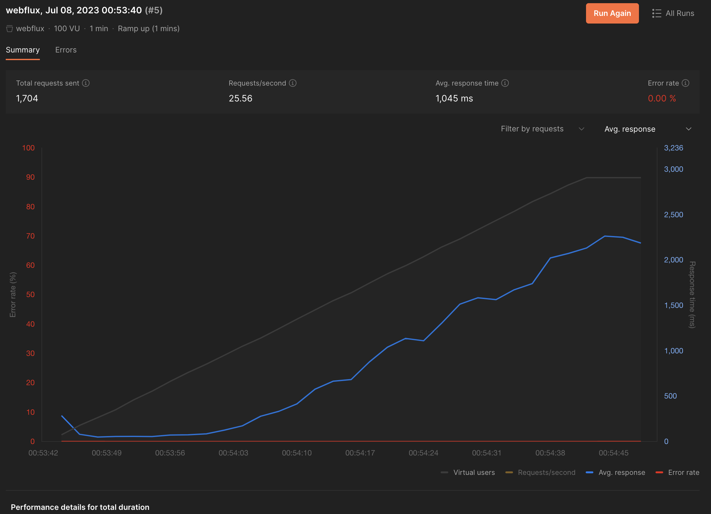
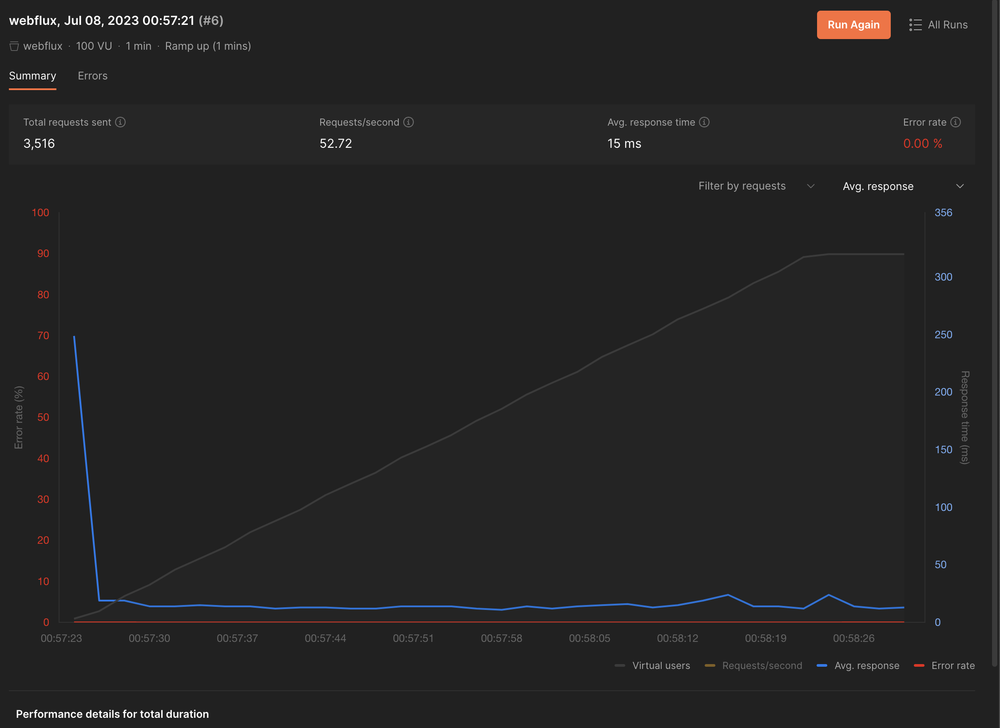

# webflux

## 테이블

### USER

~~~
CREATE TABLE IF NOT EXISTS USER(
    id      BIGINT AUTO_INCREMENT PRIMARY KEY,
    username VARCHAR(255) NOT NULL,
    password VARCHAR(255) NOT NULL,
    created_date DATETIME NOT NULL,
    last_modified_date DATETIME NOT NULL
);
~~~

### POST

~~~
CREATE TABLE if not exists POST(
    id BIGINT AUTO_INCREMENT PRIMARY KEY,
    title varchar(100) not null,
    description varchar(100) not null,
    view_count bigint not null,
    created_date DATETIME NOT NULL,
    last_modified_date DATETIME NOT NULL,
    user_id bigint not null,
    foreign key (user_id) references USER(id)
)
~~~

## SELECT,INSERT 테스트

조건 : postman runs를 이용한 테스트, 1000건 데이터 입력 후 1000건 데이터 조회 1000번 반복, user,post 연관관계 설정

### R2DBC

* 1000 데이터 입력 : 총 시간(15s661ms), 평균 시간(7ms/data)
* 1000 데이터 조회 1000번 반복 : 총 시간(50s759ms), 평균 시간(42ms/data)
* 약 37명의 사용자가 동시 요청보내기 시작하면서 응답시간이 길어짐

### JPA

* 1000 데이터 입력 : 총 시간(17s904ms), 평균 시간(8ms/data)
* 1000 데이터 조회 1000번 반복 : 총 시간(23s898ms), 평균 시간(15ms/data)

## 결론 

* 입력 테스트에서는 R2DBC가 JPA보다 소폭 빠르지만 유의미한 수준은 아닌듯하다.
* 조회 테스트에서는 R2DBC가 JPA보다 현저히 떨어지는 수치가 나온다.
* 이는 JPA에서 2차 캐시를 이용하여 조회시 DB에 접근하지 않고 캐시에서 조회하기 때문에 빠른 속도를 보여주는 것으로 보인다.
* 테스트 추가 분석 및 코드 수정을 통해 더 정확한 결과를 얻을 수 있을 것으로 보인다.

